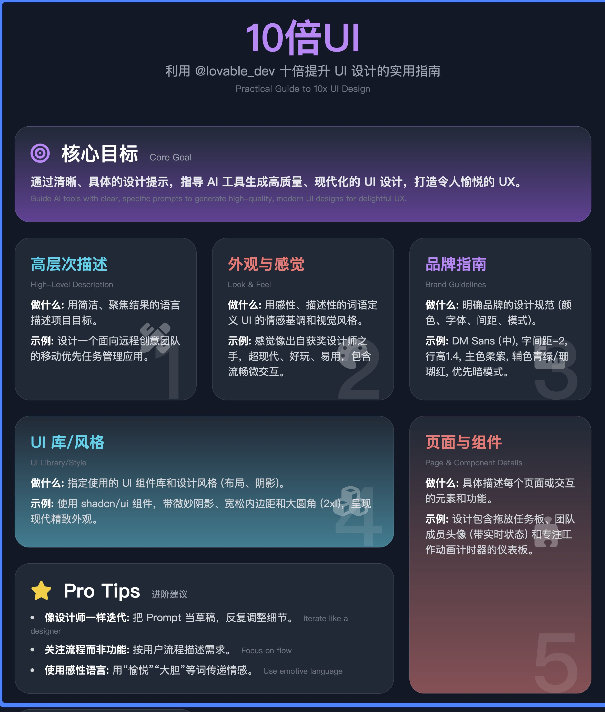

## 利用 AI 十倍提升 UI 设计的实用指南

### 核心目标
通过清晰、具体的设计提示，五个步骤：高层次描述、外观感觉、品牌指南、UI 库、页面细节。指导 AI 工具生成高质量、现代化的 UI 设计，打造令人愉悦的 UX

### 五个关键步骤

1. 高层次描述（High-Level Description）
· 做什么：用简洁、聚焦结果的语言描述你的项目目标
· 为什么：让 AI 明确你的产品是什么、为谁服务
· 示例：设计一个面向远程创意团队的移动优先任务管理应用
· Tips：保持清晰、激发灵感，突出最终成果

2. 外观与感觉（Look & Feel）
· 做什么：用感性、描述性的词语定义 UI 的情感基调和视觉风格
· 为什么：帮助 AI 理解你想要的“感觉”（如现代、活泼）
· 示例：让设计感觉像出自获奖设计师之手，超现代、好玩、易用，包含流畅的微交互和愉悦的 UX 细节
· Tips：用关键词（如优雅、活泼）传达情感

3. 品牌指南（Brand Guidelines）
· 做什么：明确品牌的设计规范，包括颜色、字体、间距和明暗模式偏好
· 为什么：确保 UI 与品牌风格一致
· 示例：使用 DM Sans 字体（中等粗细），字间距-2，行高1.4，主色柔紫，辅色青绿和珊瑚红，优先暗模式
· Tips：具体到细节（如色号、字体），避免模糊

4. UI 库/风格（UI Library/Style）
· 做什么：指定使用的 UI 组件库和设计风格（如布局、阴影）
· 为什么：统一组件行为和视觉效果，提升专业感
· 示例：使用 shadcn/ui 组件，带微妙阴影、宽松内边距和大圆角（2xl），呈现现代精致外观
· Tips：选择成熟的 UI 库，描述风格细节

5. 页面与组件细节（Page & Component Details）
· 做什么：具体描述每个页面或交互的元素和功能
· 为什么：让 AI 知道每个屏幕的具体需求
· 示例：设计包含拖放任务板、团队成员头像（带实时状态）和专注工作动画计时器的仪表板
· Tips：细化到具体功能或交互（如“拖放”）

### Pro Tips（进阶建议）
· 像设计师一样迭代：把 Prompt 当草稿，反复调整颜色、间距等细节，直到满意
· 关注流程而非单一功能：按用户流程描述需求（如“包含进度条的引导页”）
· 使用感性语言：用“愉悦”“大胆”“优雅”等词传递情感，帮助 AI 理解氛围

